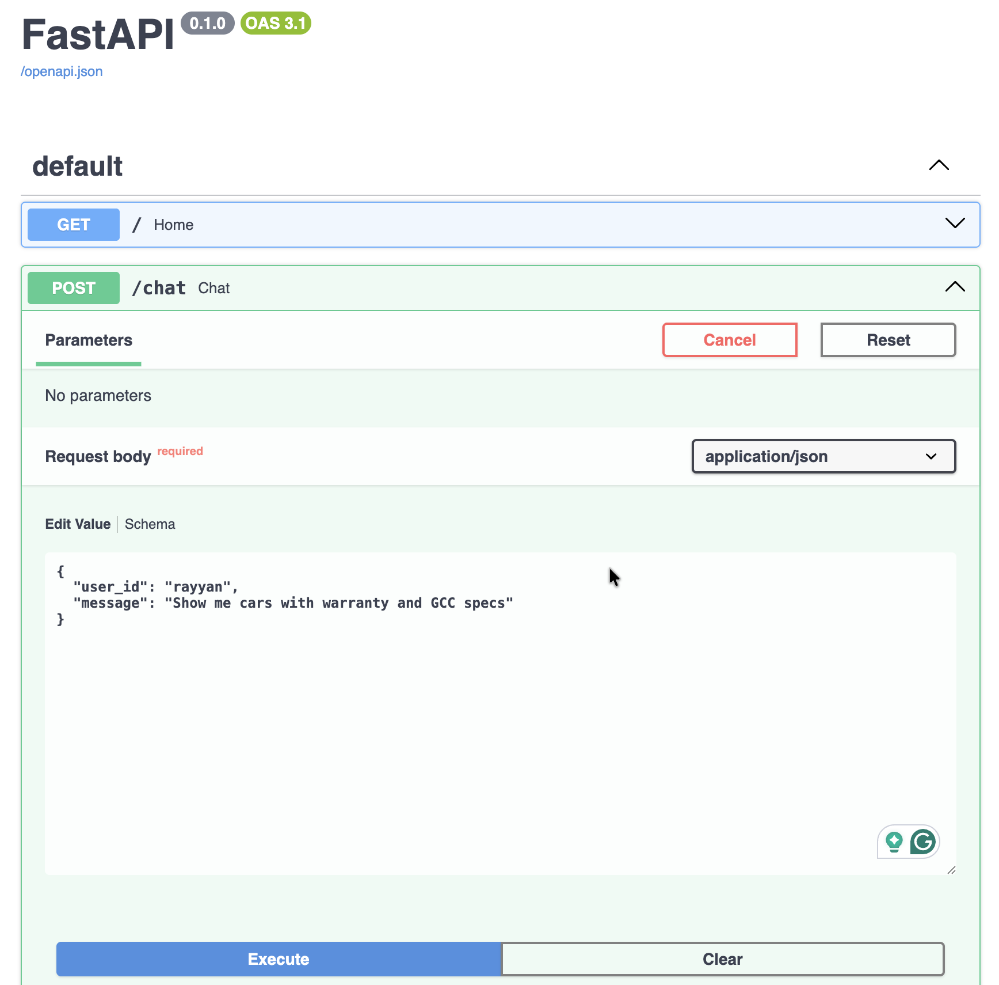
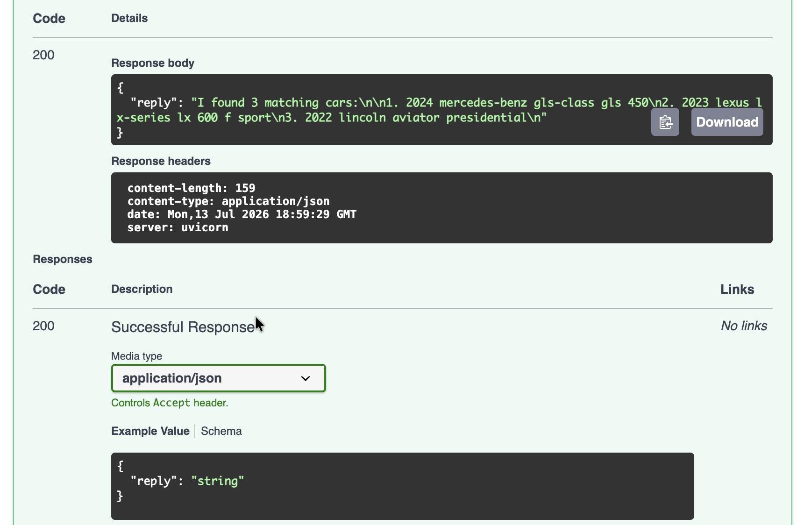

# Dubizzle AI Car Assistant

An AI-powered conversational assistant built with **FastAPI** and **Google Gemini** for the Dubizzle Machine Learning Intern take-home assignment.

The assistant allows users to search a vehicle inventory using natural language, maintain contextual conversations, book vehicle viewings, qualify sales leads, and persist user information across conversations.

---

# Features

- Natural language understanding using Google Gemini
- Deterministic inventory retrieval from a real vehicle dataset
- Hybrid search combining LLM filter extraction with Python filtering
- Multi-turn conversations with short-term memory
- Viewing appointment booking
- Lead qualification
- CSV lead persistence
- Returning user support (long-term memory)
- FastAPI REST API
- Jupyter Notebook client

---

# Project Structure

```
.
├── data/
│   ├── cars.xlsx
│   ├── users.json
│   └── leads.example.csv
│
├── models/
│   └── schemas.py
│
├── services/
│   ├── inventory.py
│   └── llm.py
│
├── tests/
│
├── client.ipynb
├── main.py
├── pyproject.toml
└── README.md
```

---

# System Architecture

```
                    User
                      │
                      ▼
          Jupyter Notebook Client
                      │
                      ▼
             FastAPI (/chat)
                      │
                      ▼
            Conversation Manager
                      │
      ┌───────────────┼────────────────┐
      │               │                │
      ▼               ▼                ▼
 Inventory Search   Booking Flow   Lead Qualification
      │
      ▼
Google Gemini
(Filter Extraction)
      │
      ▼
Deterministic Python Search
      │
      ▼
Vehicle Listings
```

---

# Design Decisions

## Client Interface

A Jupyter Notebook was selected as the client because it provides a lightweight environment for interacting with the FastAPI backend while making each API request and response easy to inspect during development. This keeps the focus on backend engineering rather than frontend implementation. It was also chosen based on personal preference.

## Search Retrieval

The assistant uses a hybrid retrieval approach.

Google Gemini is responsible only for converting natural language into structured search filters. Once these filters are extracted, Python performs deterministic filtering over the inventory using Pandas.

This approach prevents inventory hallucinations while still allowing flexible conversational search.

## Memory

Two memory mechanisms are implemented.

- Short-term memory stores conversation context within the current session, allowing follow-up questions such as "Tell me about the second one" or "Book the second one."

- Long-term memory stores user preferences using a lightweight JSON file so returning users can be recognised across sessions.

## Lead Storage

Completed leads are stored locally as a CSV file.

For a lightweight prototype this provides a simple, transparent persistence mechanism without introducing unnecessary database infrastructure.

---

# Conversation Flow

## Inventory Search

```
Natural Language Request
        │
        ▼
Google Gemini
(Filter Extraction)
        │
        ▼
Inventory Search
        │
        ▼
Matching Vehicles
```

## Booking

```
Search Cars
      │
      ▼
Book Selected Vehicle
      │
      ▼
Choose Day
      │
      ▼
Choose Time
      │
      ▼
Booking Confirmed
```

## Lead Qualification

```
Budget
   │
   ▼
Purpose
   │
   ▼
Phone Number
   │
   ▼
Lead Saved
```

---

# Installation

Clone the repository.

```bash
git clone https://github.com/<YOUR_USERNAME>/dubizzle-ai-car-assistant.git
cd dubizzle-ai-car-assistant
```

Install dependencies.

```bash
pip install -e .
```

Create a `.env` file.

```env
GEMINI_API_KEY=YOUR_API_KEY
```

Run the backend.

```bash
uvicorn main:app --reload
```

The API is available at:

```
http://127.0.0.1:8000
```

Swagger UI:

```
http://127.0.0.1:8000/docs
```

---

# Example Request

```
POST /chat
```

```json
{
  "user_id": "rayyan",
  "message": "Show me SUVs with warranty under 150000 AED"
}
```

Example response:

```
I found 4 matching cars:

1. Toyota RAV4
2. Lexus NX
3. Hyundai Tucson
4. Kia Sportage
```

---

# Technologies Used

- Python
- FastAPI
- Google Gemini
- Pandas
- Pydantic
- Jupyter Notebook
- uv (Uvicorn)

---

# Future Improvements

Future work could include:

- Database-backed user persistence
- Calendar integration for bookings
- Authentication and user accounts
- Semantic vector search
- Vehicle recommendation engine
- Production deployment
- Web frontend

---

# Screenshots

## 1. Multi-turn Inventory Conversation

> _(Insert screenshot here)_

Demonstrates:

- Inventory search
- Follow-up questions
- Booking
- Lead qualification

---

## 2. Returning User Demonstration

> _(Insert screenshot here)_

Shows the assistant recognising a returning user and recalling previous preferences from long-term memory.

---

## 3. FastAPI Swagger UI





Shows the `/chat` endpoint responding successfully through the FastAPI interactive documentation.

---

# Implementation Summary

This project implements a conversational AI assistant using FastAPI as the backend and Google Gemini for natural language understanding. Rather than allowing the language model to retrieve inventory directly, Gemini extracts structured search filters while Python performs deterministic inventory retrieval. This design improves reliability, reduces hallucinations, and keeps the assistant grounded in the provided dataset.

The project focuses on conversational behaviour through short-term memory, booking workflows, lead qualification, and lightweight persistence using JSON and CSV files. While production systems would typically introduce authentication, databases, and recommendation engines, these were intentionally kept outside the scope of this prototype to maintain simplicity and satisfy the assignment requirements.

---

# Author

Rayyan Alnimer

Dubizzle Machine Learning Intern Take-home Assignment
